## Pie Chart
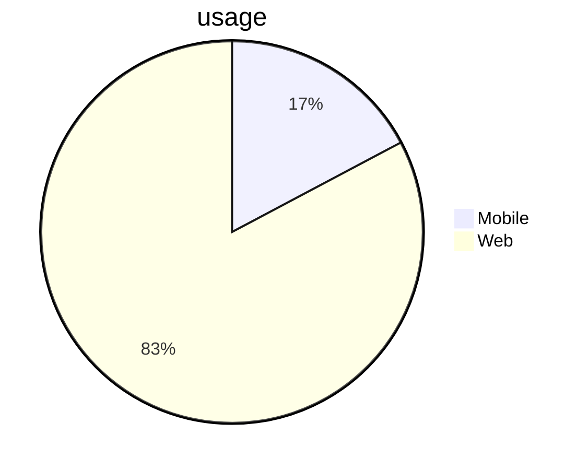

## Graph 
### Direction
to Top to Bottom `graph TB`
to Bottom to Top `graph BT`
to Left to Right `graph LR`
to Right to Left `graph RL`

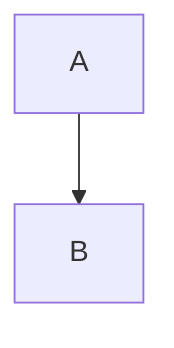

### Shapes
1. Normal Box
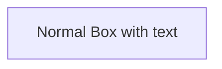
2. Pill Shaped Box
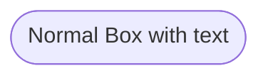
3. Box with Rounded edges
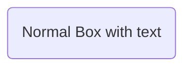
4. Subroutine shaped Box
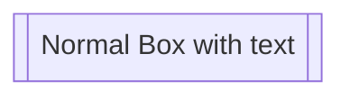
5. Cylindrical Shape
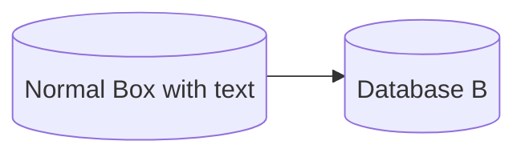
6. Circle
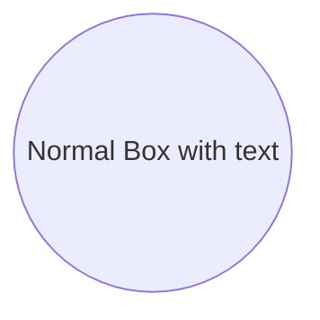
7. Asymmetric Shape
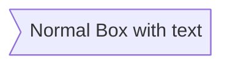
8. Rhombus
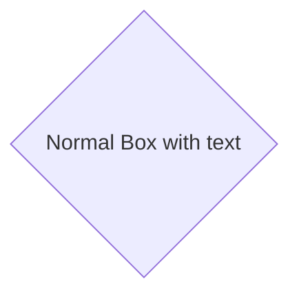
9. Hexagon
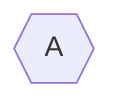
10. Parallelogram
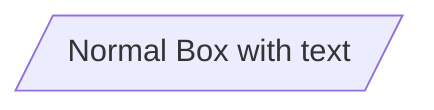
11. Parallelogram Alt
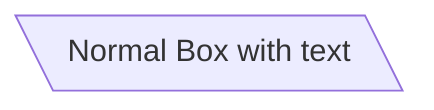
12. Trapezoid
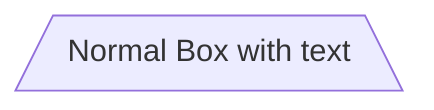
13. Trapezoid Alt
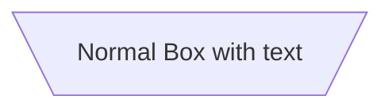

### Links
1. Arrow Head

2. Open Link
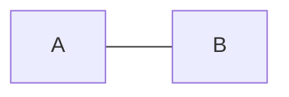
3. Text on Link
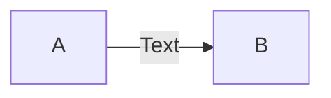
4. Dotted Link
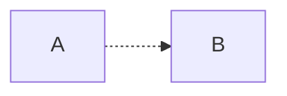
5. Dotted Link with Text
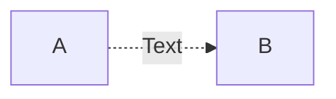
6. Thick Link
``` mermaid
graph LR
A ==> B
```


## State Diagram
```mermaid
stateDiagram-v2
Push --> Move
Move --> Stop
```
```mermaid
stateDiagram-v2
[*] --> s1
s1 --> [*]
```


